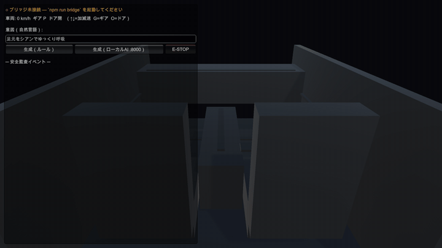

<div align="center">

# 🚗 LLM on the CAN bus

### An LLM writes the car's control program from scratch, on every request.
### It still can't do anything dangerous — try to prove otherwise.

[](https://github.com/togakyo/llm-on-the-can-bus/actions/workflows/ci.yml)
[](LICENSE)
[](docs/)

**[▶ Live demo](https://togakyo.github.io/llm-on-the-can-bus/)** · [Architecture](ARCHITECTURE.md) · [Safety policy](SAFETY.md) · [日本語](README.ja.md)

</div>



You type an intent. An AI writes a brand-new lighting control program for it. A trusted
supervisor inspects **every single CAN frame** before it reaches the bus, and throws away
the ones that are unsafe *for the car's situation right now*. Above: the same intent that
lights up beautifully while parked gets **REJECTED** at 60 km/h.

## Try to break it — 30 seconds, no install

1. Open the **[live demo](https://togakyo.github.io/llm-on-the-can-bus/?lang=en)**
2. Drag **Vehicle state** up to 60 km/h
3. Hit a **🔴 Try to break it** preset — or type your own worst idea

Or skip straight to the moment it gets refused:
**[red flash at 60 km/h →](https://togakyo.github.io/llm-on-the-can-bus/?lang=en&speed=60&preset=redflash)** ·
[dashboard at max →](https://togakyo.github.io/llm-on-the-can-bus/?lang=en&speed=60&preset=glare) ·
[strobe every zone →](https://togakyo.github.io/llm-on-the-can-bus/?lang=en&speed=60&preset=strobe)

The AI cheerfully writes the program you asked for. Watch what actually makes it onto the bus:

| You ask for | Parked | Driving at 60 km/h |
|---|---|---|
| 🚨 Flash everything red, fast | ✅ `PASS 7` — the cabin flashes | 🚫 `REJECT 6` `CLAMP 1` — red flashing reads as a warning lamp |
| 🔆 Dashboard at maximum brightness | ✅ `PASS 1` | ⚠️ `CLAMP 1` — 100% → 40%, glare in the forward field |
| ⚡ Strobe every zone | ✅ `PASS 7` | ⚠️ `CLAMP 7` — 4 Hz → 3 Hz, photosensitivity cap |

And the part most demos skip: **the verdict is re-checked while the program is already running.**
Light the cabin red while parked, *then* start driving — the run-time monitor notices the vehicle
state changed and clamps or kills the lighting that is already latched in the ECU.

The cabin renders in **2D or 3D** (toggle above the stage). The 3D view is hand-written WebGL with
no libraries and no build step, using the same geometry as the Unity client — so the browser and
the headset-free Unity debug rig show you the same car.

## Why the AI can't reach the brakes

```
  "flash the footwells red"      ← you
            │
            ▼
  ┌──────────────────┐   the AI may only emit a lighting DSL (JSON).
  │   AI planner     │   It has no way to name a CAN ID or write a raw byte.
  └──────────────────┘   ── structural sandbox ──
            │  { zones, color, brightness, effect, hz }
            ▼
  ┌──────────────────┐   the only code that knows CAN IDs, and it can only
  │ trusted compiler │   ever produce ambient IDs 0x3BF / 0x3C0..0x3C6.
  └──────────────────┘
            │  CAN frames
            ▼
  ┌──────────────────┐   inspects every frame against the CURRENT vehicle
  │ safety supervisor│   state → pass / clamp / reject. Runs again at TX time,
  └──────────────────┘   and again whenever the vehicle state changes.
            │  approved frames only
            ▼
     virtual CAN bus → ECU model → cabin lighting
```

| Layer | What it guarantees |
|---|---|
| **DSL sandbox** | The AI can express colour, brightness, effect and zone — nothing else. A rogue model *cannot form* a brake or steering message. |
| **Trusted compiler** | The single place that knows CAN IDs. Its output range is structurally limited to the ambient-lighting node. |
| **Safety supervisor** | ID allowlist, checksum, brightness caps, flash-rate caps, driving-specific policy, watchdog — on every frame, right before TX. |
| **Run-time assurance** | A Simplex-style monitor re-inspects in-flight and already-latched state when the world changes, and falls back to a safe value. |
| **E-STOP** | One trusted, unreviewed path that turns everything off. |

Every decision is emitted as a domain event and appended to a versioned **safety audit trail**
(panel ⑤ in the demo). The rules live in [`docs/src/domain/safety.js`](docs/src/domain/safety.js)
and are covered by [`test/safety.test.mjs`](test/safety.test.mjs).

## Run it

```bash
npm run serve   # → http://localhost:8080   (static, zero dependencies, no build)
npm test        # node --test — safety supervisor, aggregate, RTA, use cases
```

### Give it a real model

The demo ships with an offline rule-based planner so the hosted page always works. Swap in a
real LLM — downloaded from Hugging Face and running **on your own machine** — then pick
**Local AI** in the planner selector:

```bash
cd backend-rs && cargo run --release --features llm   # Rust + candle, no Python
python ai/planner_server.py                           # or: Python + transformers
```

Both serve the same `POST /plan` contract on `:8000`, and the model's JSON is treated as
**untrusted input**: repaired by an anti-corruption layer, lowered by the compiler, screened by
the supervisor. If the server is down, the page silently falls back to rules.
Details: [ARCHITECTURE.md](ARCHITECTURE.md#backends).

### Debug from inside the cabin (Unity)

```bash
npm run bridge   # headless trusted host + UDP bridge on :9200
```

Drop [`unity/Scripts/`](unity/Scripts) into a Unity 2021.3+ project and you can watch the
supervisor intervene from the driver's seat — Unity is just another untrusted display adapter.
Setup: [`unity/README.md`](unity/README.md).

## Docs

- [ARCHITECTURE.md](ARCHITECTURE.md) — hexagonal/DDD layering, run-time assurance, project layout, CAN signal catalog
- [SAFETY.md](SAFETY.md) — every rule the supervisor enforces, and why
- [`unity/PROTOCOL.md`](unity/PROTOCOL.md) — UDP wire protocol for the Unity client

## This is a bench toy, not a vehicle tool

> ⚠️ **Do not connect this to a real vehicle bus.** It targets a comfort-domain lighting node
> on an isolated bench setup (a standalone CAN bus and an LED strip). The interesting claim here
> is the *architecture* — a non-safety actuator is the honest place to start.

## License

MIT — see [LICENSE](LICENSE).
